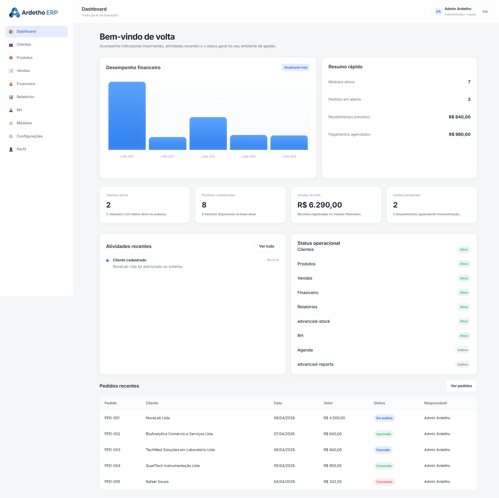

# Ardetho ERP



Ardetho ERP is a modular and customizable enterprise resource planning system developed as an academic front-end project.  
The project was created to simulate a modern ERP environment with public presentation pages and an internal authenticated area, focusing on usability, modularity, branding customization, and interface consistency.

---

## Overview

The main idea of Ardetho ERP is to provide a management platform that can be adapted according to different business profiles.  
The environment was structured to support a modular approach, allowing the system to grow progressively with the company.

The project includes:

- a public presentation area
- an internal ERP area
- module activation and deactivation
- company branding customization
- HR management
- dashboard visualization
- LocalStorage-based persistence

---

## Main Features

### Public pages
- Home page
- About page
- Modules page
- Contact page

### Internal ERP pages
- Login
- Dashboard
- Clients
- Products
- Sales
- Financial
- Reports
- HR
- ERP Modules
- Settings
- Profile

### Functional highlights
- Authentication with protected internal routes
- Multi-user simulation with different company identities
- Company branding customization:
  - company name
  - display name
  - logo
  - favicon
  - primary color
  - accent color
- Dynamic dashboard with:
  - metrics
  - notifications
  - summary
  - activities
  - financial chart
  - operational status
- Clients module with PF/PJ structure
- Products and services module
- Sales module
- Financial module with income and expenses
- Reports connected to internal data
- ERP modules activation/deactivation
- HR module with:
  - employee listing
  - salary field
  - status filter
  - department filter
  - employee form
  - create/edit/delete operations

---

## Technologies Used

- HTML5
- CSS3
- JavaScript (Vanilla JS)
- LocalStorage
- Google Fonts (Inter)

---

## Project Structure
```text
/
├── index.html
├── about.html
├── modules.html
├── contact.html
├── login.html
├── dashboard.html
├── clients.html
├── client-form.html
├── products.html
├── product-form.html
├── sales.html
├── sale-form.html
├── financial.html
├── financial-form.html
├── hr.html
├── hr-form.html
├── reports.html
├── erp-modules.html
├── settings.html
├── profile.html
│
├── assets/
│   ├── css/
│   │   ├── variables.css
│   │   ├── reset.css
│   │   ├── global.css
│   │   ├── layout.css
│   │   ├── components.css
│   │   ├── public.css
│   │   ├── auth.css
│   │   ├── dashboard.css
│   │   ├── pages.css
│   │   └── responsive.css
│   │
│   ├── js/
│   │   ├── data.js
│   │   ├── storage.js
│   │   ├── auth.js
│   │   ├── dashboard.js
│   │   ├── clients.js
│   │   ├── client-form.js
│   │   ├── products.js
│   │   ├── product-form.js
│   │   ├── sales.js
│   │   ├── sale-form.js
│   │   ├── financial.js
│   │   ├── financial-form.js
│   │   ├── reports.js
│   │   ├── modules.js
│   │   ├── settings.js
│   │   ├── profile.js
│   │   ├── hr.js
│   │   └── hr-form.js
│   │
│   └── images/
│       ├── ardetho-logo.png
│       ├── ardetho-icon.png
│       ├── preview-dashboard.png
│       ├── mecanica-xyz-logo.png
│       └── mecanica-xyz-icon.png
│
├── README.md
├── LICENSE
└── .gitignore
```
---

## Public Navigation

The project includes a public presentation flow before login:

- `index.html`
- `about.html`
- `modules.html`
- `contact.html`

These pages were created to make the repository look more complete and professional, simulating a real product presentation website.

## Internal Modules

### Dashboard
Displays key operational information, metrics, summaries, notifications, and internal activity.

### Clients
Handles company and individual clients, with full address and registration details.

### Products
Manages products and services, including category, supplier, stock, price, and status.

### Sales
Organizes orders, clients, products/services, payment methods, and sales workflow.

### Financial
Tracks income and expenses, payment status, due dates, descriptions, and financial summaries.

### Reports
Provides views connected to internal data and export-oriented summaries.

### ERP Modules
Allows activation and deactivation of modules according to the desired environment profile.

### Settings
Provides visual and behavior customization of the system.

### Profile
Allows editing the current user and company branding with logo, favicon and colors.

### HR
Handles employee records with department, salary and status.

## Authentication Example

The project simulates different environments through different accounts.

### Master environment
- Email: `admin@ardetho.com`
- Password: `123456`

### Client environment
- Email: `admin@mecanicaxyz.com`
- Password: `123456`

When logging in with different users, the environment can reflect different company branding.

## Branding Customization

One of the strongest aspects of the project is the branding customization flow available through the Profile page.

The system supports:

- custom company name
- custom display name
- custom logo
- custom favicon
- custom primary color
- custom accent color

This allows the ERP to simulate white-label or client-specific environments.

## Data Persistence

The project uses `LocalStorage` as the persistence layer.

Main stored structures include:

- application data
- current user
- current company
- active modules
- settings and visual preferences

Because the project evolved over time, if a new structure is added to `data.js`, the browser may still keep an older `LocalStorage` version.

In that case, you can reset the local environment in the browser console with:

```javascript
resetAppData();
```
---

## Educational Purpose

This project was developed for academic and portfolio purposes, with focus on:

- front-end architecture
- modular systems
- interface consistency
- LocalStorage persistence
- customization logic
- dashboard composition
- public + private navigation structure

## Future Improvements

Possible future improvements include:

- real backend integration
- multi-tenant separated datasets
- advanced user and permission management
- real public contact form integration
- advanced analytics and reports
- stronger HR workflows
- inventory expansion
- better synchronization between user session and editable profile
- attachment/image upload flow instead of manual URL fields

## How to Run

Because this is a front-end project with static files and LocalStorage persistence, you can run it locally by opening the HTML files in the browser or by using a simple local server.

Examples:

- open `index.html`
- or serve the project folder with a local development server