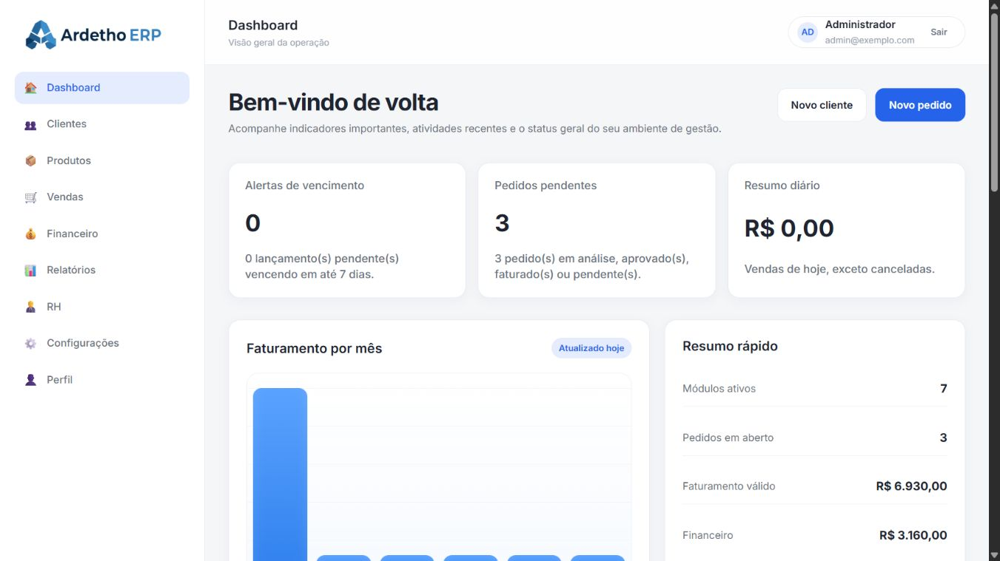
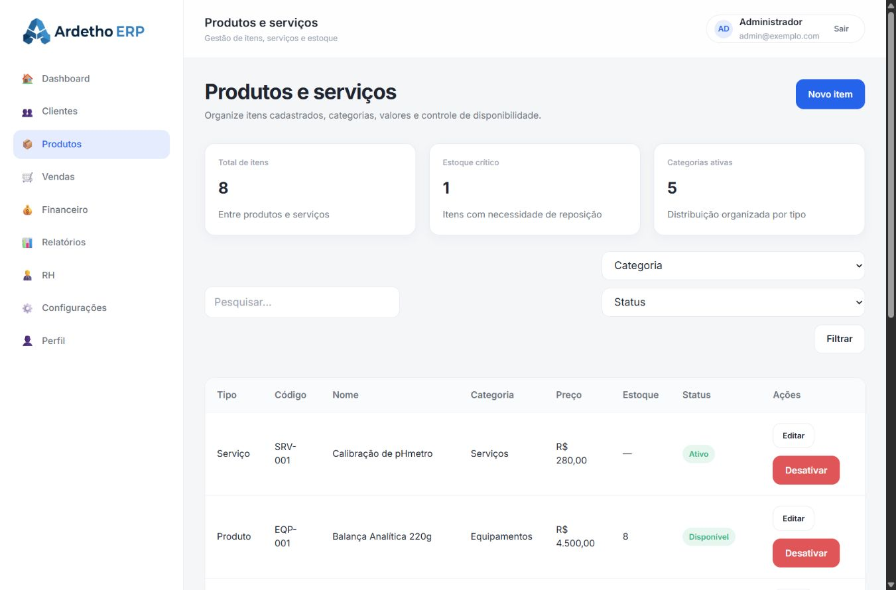
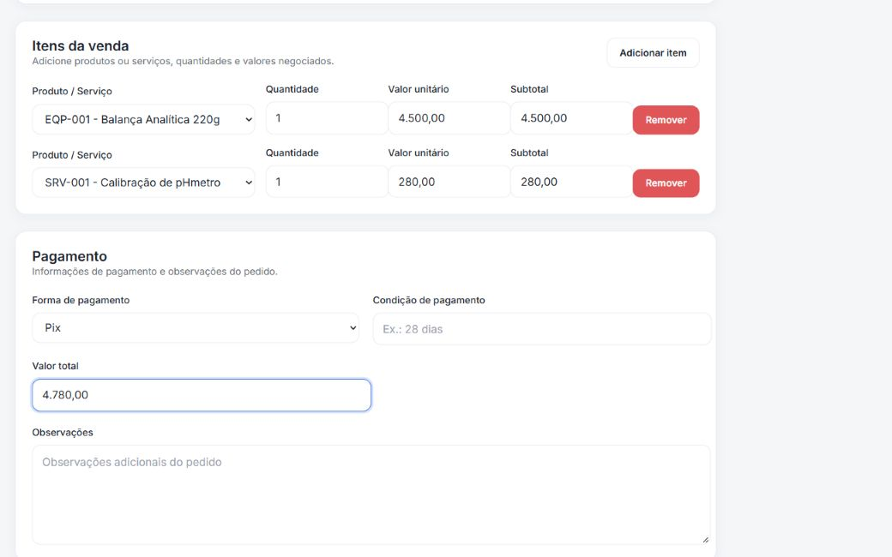
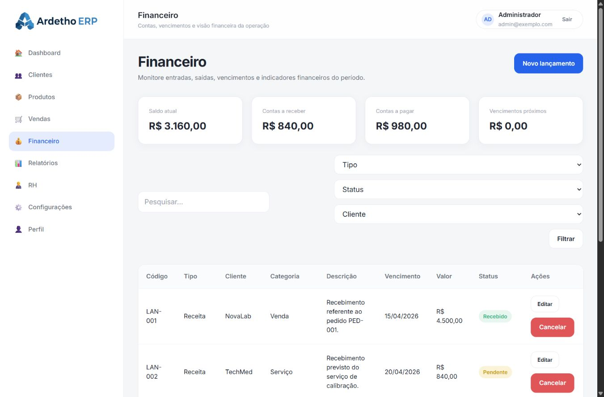
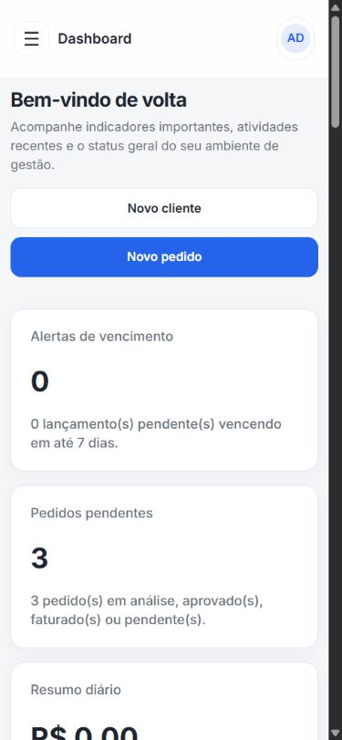

# Ardetho ERP

Um sistema ERP acadêmico desenvolvido em PHP e MariaDB para centralizar operações administrativas e comerciais.

## Funcionalidades

- Autenticação de usuários e Dashboard com indicadores da operação.
- Cadastro, gestão, busca e filtros de Clientes e de Produtos e Serviços.
- Vendas com múltiplos itens, cálculo de valores e acompanhamento de status.
- Lançamentos financeiros, vencimentos e saldos.
- Relatórios com filtros e exportação CSV.
- Cadastro de colaboradores em Recursos Humanos.
- Perfil do usuário e Configurações do sistema.
- Gestão de usuários pelo administrador, alteração de senha e troca obrigatória após senha temporária.

## Interface

**Dashboard**



**Produtos e serviços**



**Venda com múltiplos itens**



**Financeiro**



**Visualização móvel**



As telas mostram apenas dados demonstrativos.

## Tecnologias

PHP 8.1 ou superior, MariaDB/MySQL, PDO, Apache, HTML5, CSS3 e JavaScript. O ambiente validado usa XAMPP para Windows com PHP 8.2.12, Apache 2.4.58 e MariaDB 10.4.32.

## Estrutura do projeto

```text
ardetho-erp/
|-- assets/
|   |-- css/
|   |-- images/
|   `-- js/
|-- config/
|-- controllers/
|-- database/
|   |-- ardetho.sql
|   |-- criar-admin.php
|   |-- importar-dados-demo.php
|   |-- seed-demo.json
|   `-- migrations/
|-- docs/
|   `-- images/
|-- includes/
|-- models/
|-- index.php
|-- login.php
|-- dashboard.php
|-- clientes.php
|-- produtos.php
|-- vendas.php
|-- financeiro.php
|-- relatorios.php
|-- rh.php
|-- perfil.php
|-- alterar-senha.php
|-- usuarios.php
|-- usuario-form.php
`-- configuracoes.php
```

As páginas e formulários PHP ficam na raiz. `models/` acessa os dados, `controllers/` trata as requisições, `includes/` reúne componentes e recursos compartilhados, e `config/` define a conexão com o banco. `assets/` contém a interface; `database/` contém o esquema e os utilitários de instalação.

## Como executar

### Requisitos

Instale o XAMPP com Apache, MariaDB/MySQL, phpMyAdmin e PHP 8.1+ com `PDO` e `pdo_mysql` habilitados. Não é necessário instalar dependências com Composer.

### 1. Copiar o projeto

Copie ou clone o projeto para `C:\xampp\htdocs\ardetho-erp`.

### 2. Iniciar o XAMPP

No XAMPP Control Panel, inicie **Apache** e **MySQL**.

### 3. Criar e importar o banco

Abra [http://localhost/phpmyadmin/](http://localhost/phpmyadmin/). Em **Bancos de dados**, crie `ardetho_erp`. Se houver opção de colação, escolha `utf8mb4_unicode_ci`.

1. Selecione `ardetho_erp` na barra lateral do phpMyAdmin.
2. Abra a aba **Importar** desse banco.
3. Selecione `database/ardetho.sql` na pasta do projeto e execute a importação.

Esse arquivo contém o esquema completo para uma instalação nova. Não execute `database/migrations/` depois de importá-lo.

### 4. Acessar o Ardetho

Abra [http://localhost/ardetho-erp/](http://localhost/ardetho-erp/). A raiz redireciona para `login.php`. Se você escolheu outro nome para a pasta em `htdocs`, ajuste a URL.

**Credenciais iniciais de demonstração:** e-mail `admin@ardetho.local`, senha `12345678`. Após entrar, a senha pode ser alterada em **Perfil**. Essas credenciais não são adequadas para uso em produção.

### Usuários do sistema

Em **Configurações > Gerenciar usuários**, o administrador pode criar usuários com nome, e-mail, cargo, departamento, perfil e senha temporária; também pode ativar, desativar e redefinir senhas. Usuários comuns não acessam essa gestão. Quem recebe uma senha temporária deve alterá-la no primeiro acesso.

### Dados demonstrativos (opcional)

Para preencher o ERP com dados de exemplo, execute na pasta do projeto:

```powershell
& "C:\xampp\php\php.exe" database\importar-dados-demo.php
```

O importador usa `database/seed-demo.json`, não cria usuários e pode ser executado novamente sem duplicar os registros importados. O sistema funciona sem esses dados.

## Teste rápido

Entre com o administrador padrão, abra o Dashboard e acesse **Configurações > Gerenciar usuários**. Opcionalmente, crie um usuário de teste. Cadastre um Cliente e um Produto ou Serviço, crie uma Venda e confira os indicadores no Dashboard. Depois, visite Financeiro e Relatórios.

## Arquitetura

Os Models consultam e gravam no MariaDB por PDO. Os Controllers validam os dados e coordenam o fluxo. As páginas PHP exibem as Views; `includes/` fornece autenticação, sessão, proteção CSRF e partes compartilhadas da interface.

## Segurança implementada

O projeto utiliza `password_hash`/`password_verify`, sessão PHP com regeneração do ID no login, tokens CSRF nos formulários, consultas preparadas com PDO e escape de dados exibidos em HTML. Usuários inativos não autenticam; redefinições administrativas exigem nova senha temporária. Status como inativação e cancelamento preservam registros quando aplicável. Esses recursos não substituem uma avaliação de segurança para uso em produção.

## Banco de dados

`database/ardetho.sql` é o esquema completo para uma instalação nova. `database/migrations/` contém atualizações incrementais para bancos existentes; `004_usuarios_acesso.sql` atualiza instalações anteriores à gestão de usuários. **Não** execute migrations depois de importar o esquema completo.

### Configuração avançada do banco

Em um XAMPP padrão, `config/database.php` usa `127.0.0.1:3306`, banco `ardetho_erp`, usuário `root` e senha vazia. Para outra configuração, defina `DB_HOST`, `DB_PORT`, `DB_NAME`, `DB_USER` e `DB_PASS` no ambiente do Apache e dos utilitários PHP CLI.

## Observações

Este é um projeto acadêmico. O acesso depende de Apache e MariaDB ativos; os dados são persistidos no banco, não no navegador.
